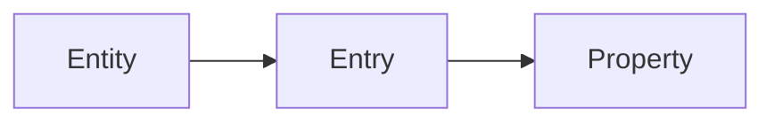
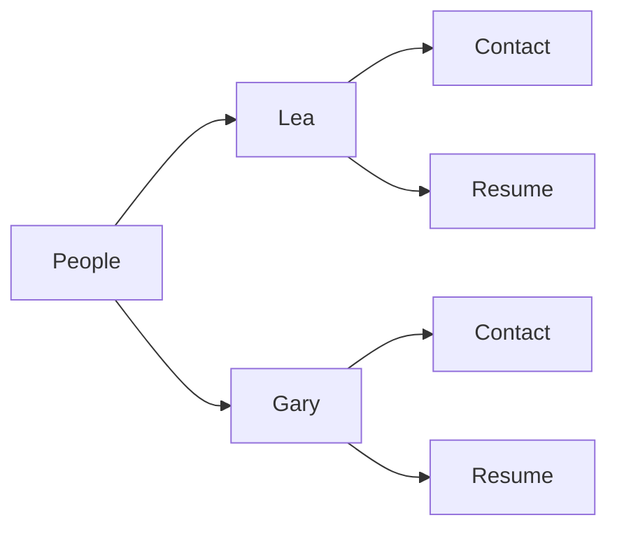
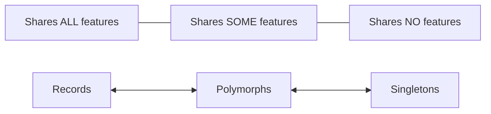

<div align="center">

# Astro Content

**𝚊𝚕𝚙𝚑𝚊**

👷🏻‍♂️  Under heavy development, use it at your own risk!   🚧

\~  
Suggestions are welcome  
👐

❀✿❀

<a href="https://astro-content.netlify.app" target="_blank">


**Documentation / Live demo website**

---


</a>

</div>

## What is it?

Think of it as an hybrid of **Wordpress** + ACF, **Obsidian** and **Ulysses**, with a sprinkle of **tRPC** and **nuxt/content**.

## What it does?

✨  Adds a thin layer between Astro and your templates, bringing automatic **typings**, runtime validation and a handful of **DX** goodies.

🏗  Brings evolved authoring assistance, in a **full-fledged** back-office, inside your **IDE** or with **CLI**, as you prefer.

## Main goals

Being content centric, this set of tools will give you:

- **Focus** when designing 👌
- **Confidence** when authoring ✍️
- **Predictability** when integrating 🤝
- **Certainty** while delivering 💪
- **Peace** of mind when refactoring 👍

---

<div class="git-only">

- [Installations](#installations)
  - [Quick setup](#quick-setup)
  - [Template usage](#template-usage)
  - [TypeScript setup](#typescript-setup)
- [Design concepts](#design-concepts)
  - [Hierarchy](#hierarchy)
  - [Directory structure](#directory-structure)
  - [Naming conventions](#naming-conventions)
- [Reports](#reports)
- [Tips and tricks](#tips-and-tricks)
- [Development](#development)
  - [Setup](#setup)
  - [Packages](#packages)
- [Work in progress](#work-in-progress)

</div>

# Installations

## Quick setup

With `yarn`, `npm` or `pnpm`, run this in your **existing** Astro project:

```sh
# If you want a fresh start ——v
# pnpm create astro && cd ./my-astro-site

pnpm astro add astro-content
pnpm content setup
```

Follow the prompts… 🐇

<div align="center">

_**— Or —**_

</div>

Another method is to shallow **clone** this minimal Astro **starter**, which comes with dummy **content** for you to play with:

```sh
pnpx degit JulianCataldo/astro-content/demo ./ac-demo
cd ./ac-demo && pnpm install
code .
```

> **Warning**: Only **Node 17** or higher is actually supported by Astro Content.

---

OK, **project is ready**. It's time to:

```sh
pnpm run dev
```

Now head over to [http://localhost:3000/**\_\_content**](http://localhost:9054/__content) to take a deep dive in Astro Content.

## Template usage

In an Astro **page**:

<!-- prettier-ignore -->
```astro
---
import { get } from '/content';

// Fetch everything
const allContent = await get(Astro.glob('/content/**/*.{md,mdx,yaml}'));

// ✨ Start typing a '.' ———————————v
const tryAutoCompletion = allContent ;  

// Narrow fetching to some entities, for performance
const content = await get(
  Astro.glob('/content/{robots,people}/**/*.{md,mdx,yaml}'),
);

// Let's be more specific
const bigGrumpy = content?.robots?.bigGrumpy;
// Or even
const BigGrumpyMainContent = content?.robots?.bigGrumpy?.main.Content;
---

<bigGrumpy.main.Content />

<BigGrumpyMainContent />

<span>{bigGrumpy?.meta?.price}</span>

<!-- Pass data down to component, with end-to-end type safety -->
<Robot feats={bigGrumpy}>
```

In an Astro **component**:

<!-- prettier-ignore -->
```astro
---
import type { Robot } from '/content';

// Augment your <Robot /> `Props`
const { feats } = Astro.props as { feats: Robot };
---

<feats.main.Content />

<!-- As always, you get type safety and auto-completion everywhere! -->
<!-- If it can break here, you'll know it soon while refactoring. -->
<span>{feats?.meta?.price}</span>

```

## TypeScript setup

It's OK to use an absolute path, so you don't have to do tedious relative imports:

```tsx
import { get } from '../../content';
// Versus:
import { get } from '/content';
```

Astro / Vite resolve absolute paths from project root. That's cool,
but TypeScript language server (in your IDE) will likely break, while showing
red squiggles.

A very simple fix is adding this to your `tsconfig.json` > `compilerOptions.paths`:

```jsonc
{
  "compilerOptions": {
    // …
    "paths": {
      // Make TS happy with all absolute paths
      // "/*": ["./*"]

      // Or more specifically for your Astro Content base helpers
      "/content": ["./content"]
    }
  }
}
```

# Design concepts

## Hierarchy

Conventions are modeled upon this relatively flat hierarchy:



<div align="center">

…which practically gives:

</div>



Why this 3-levels nesting? Here is the logic behind this:

- Mimic a relational database design as: **Table** > **Row** > **Column**.
- …or a document based DB (as Mongo) like: **Collection** > **Document** > **Field**.
- Reduce mental load, too many levels makes thing exponentially harder to track.
- Encourage cross-referencing documents and re-usability, over brittle, overly specific deep nesting.
- 1 level = 1 business concern = 1 physical "role", mirrored in paths structure.
- With CMS, like Wordpress or Strapi, you typically get "post types" and "pages" with their own "fields", all of which are mapped to the RDBMS.

Please note that a property (file) itself, like a `<person>/contact.{md,mdx,yaml}` can host as many levels as you need.  
It's JSON, in the end, even if it is expressed in pure YAML or YAML in Markdown front matter.

> **Note**: Astro Content might support content base switching in the future, that means one more level, if you really need it.  
> In the meanwhile, you can merge entities, when glob-importing, with symbolic links (see _Tips and Tricks_ section),
> or simply using different Astro projects, if it's OK for you.

It should be possible to make Astro Content support indefinite levels of nesting,  
reflecting your own intricate schema design. But for now, it will make development too convoluted, while not being desirable in most cases,
so we stick to the widely spread conventions described above.

If you feel like a property (file) is going into a black hole, with multiples sub-properties, **extract it to a new entity**, then make **cross-references**, later resolved in your **application** itself (see MongoDB development patterns).

## Directory structure

Example directory structure for your `./content` base:

```sh
content
├── default.schema.yaml           # <- Mother of all newly created entities,
│                                 #    it's customizable.
│
├── [entities]                    # —————————————— Theoretical model ———————————
│   │
│   ├── [entity].schema.yaml      # <- Actual schema defining single entries.
│   ├── [entry]
│   │   ├── [property-a].yaml
│   │   ├── [property-b].yaml     # <- Property (file) can be optional.
│   │   └── [property-c].md
│   │
│   │
│   │                             # —————————————— Real world examples —————————
├── people
│   ├── person.schema.yaml        # <- Notice singular entity name for schema.
│   ├── pierre-corneille
│   │   ├── gallery.yaml
│   │   └── biography.md
│   ├── jean-racine
│   │   ├── gallery.yaml
│   │   ├── references.yaml
│   │   └── biography.md
│   │
├── pages
│   ├── page.schema.yaml          # <- An entry can share ALL, SOME,
│   ├── home                      #    or NONE of schema defined properties,
│   │   ├── header.md
│   │   ├── main.md
│   │   └── footnotes.md
│   ├── contact
│   │   ├── main.md
│   │   ├── resume.md
│   │   └── links.yaml
│   ├── not-found
│   │   ├── message.md
│   │   └── cool-meme.md
├── ...
│   └── ...
│
└── index.ts                      # <- Import helper. You can ignore it.
```

Entries can share the same features, can have some of their own, or even be totally independent.  
That's it: an entry can be part of a collection like "My vacation" in "Blog posts", or a singleton like "My resume" in "Web pages".

An entry is a flexible concept. As a part of an entity, you could make it relaxed, or very strict.  
Astro Content doesn't care on how you design your content base, it's up to you.

<div align="center">

**Entries** singularity spectrum:

</div>



## Naming conventions

Naming can be done inside JSON Schemas themselves with `title`, or if not set, will be inferred from your file paths.

**`my-blog-post.md`** automatically becomes **"My blog post"** for display and **`myBlogPost`** for JavaScript object paths.

# Reports

You can benefit from these three levels of content checks:

1. **Schema** structure
2. File **language syntax** linting
3. **Natural language** linting

# Tips and tricks

- Symbolic links are working, useful for gathering markdown from relative folder in the same mono-repo., for example here, in [`docs` content](https://github.com/JulianCataldo/astro-content/tree/master/docs/content).
- Folder hierarchy is flattened. It's the `*.schema.yaml` that is authoritative on "what is an entity" to collect, as in the sibling entries folders.
- Use `@` or `_` prefixes, if you want to pin entities on top, e.g.: `@inbox`.  
  Special characters are stripped out anyway, while retaining order for inside your editor (OK, it's a hack 😅).

Some of these tips here are experiments, or found by accident. They might explode in your hands. It's an alpha version after all 🤫.

# Development

> **Note**: `pnpm` is the package manager of choice for developing this mono-repo.  
> macOS / Node >= 17 is the most tested environment.
> Please note that end-user can use anything recommended for a typical Astro project while using Astro Content distributables.

## Setup

```sh
git clone git@github.com:JulianCataldo/astro-content.git
cd astro-content

pnpm -r i

# ———— Watch / build mono-repo. (turbo)
pnpm run dev

# ———— Doc. website (astro)
cd docs && pnpm run dev
```

## Packages

<!-- Man, this table is horribly long -->

| Role                                                                                                                              | Notes                                          | Name                    | Artefact                                                                                                    |
| --------------------------------------------------------------------------------------------------------------------------------- | ---------------------------------------------- | ----------------------- | ----------------------------------------------------------------------------------------------------------- |
| [**Integration** ](https://github.com/JulianCataldo/astro-content/tree/master/packages/integration) <small>_(Entrypoint)_</small> | Extends Astro / Vite capabilities              | `astro-content`         | [](https://www.npmjs.com/package/@astro-content/gui)      |
| [**Server**](https://github.com/JulianCataldo/astro-content/tree/master/packages/server)                                          | Data handlers, API provider, helpers generator | `@astro-content/server` | [](https://www.npmjs.com/package/@astro-content/gui) |
| [**Command line**](https://github.com/JulianCataldo/astro-content/tree/master/packages/cli)                                       | Project setups and content manipulation        | `@astro-content/cli`    | [](https://www.npmjs.com/package/@astro-content/gui) |
| [**Web app**](https://github.com/JulianCataldo/astro-content/tree/master/packages/gui) <small>_(Optional)_</small>                | Full-fledge content editor / monitor           | `@astro-content/gui`    | [](https://www.npmjs.com/package/@astro-content/gui) |
| [TypeScript **typings**](https://github.com/JulianCataldo/astro-content/tree/master/packages/types)                               | Internal types for development use             | `@astro-content/types`  | [](https://www.npmjs.com/package/@astro-content/gui) |
| [**Docs**](https://github.com/JulianCataldo/astro-content/tree/master/docs) <small>_(Private)_</small>                            | Using and demonstrating all tools above        |                         | [`astro-content.netlify.app`](https://astro-content.netlify.app/)                                           |
| [**Demo**](https://github.com/JulianCataldo/astro-content/tree/master/demo) <small>_(Clonable)_</small>                           | Minimal boilerplate                            |                         | [./demo](https://github.com/JulianCataldo/astro-content/tree/master/demo)                                   |

`@astro-content/*` are all internal dependencies of the main `astro-content` integration package, which act as a bridge for them.  
Web GUI can be opted out by user settings.

# Work in progress

- [ ] Rehaul Astro `MarkdownInstance` <=> `MardownFile` schema definition <=> `MarkdownFile` TS interface.
  - `Content` Astro component especially, is not propertly typed.
- [ ] Same for `YamlInstance`, which need some love, generally.
- [ ] Actual runtime JSON Schema validation, not just _reporting_ errors, but pro-actively preventing them to occur, with opt-out capabilities.
- [ ] Custom Markdown linting rules -> Should hook up with `.remarkrc.mjs`, so user benefit from both IDE and Web app custom rules.
- [ ] …

<div class="git-only">

---

🔗  [JulianCataldo.com](https://www.juliancataldo.com)

</div>
