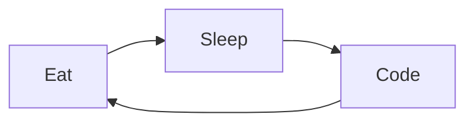

This is a proto-storybook. A live playground.  
No frills. Just the code, and its living preview.

{/* This is where Astro Content really shines: Rich MDX preview FTW! */}

import ThreeJuggler from '/src/components-demo/ThreeJuggler';
import AsciinemaPlayer from '/src/components/AsciinemaPlayer.astro';
import MediaMap from '@julian_cataldo/astro-media-map/MediaMap.astro';

{/* Vite can embed arbitrary, relative files in `dist`, */}
{/* providing URL for you to use in MDX, Astro, JSX… */}
{/* How cool is that? ———————————v */}
import asciiCastDemo1 from './demo.cast?url';

## React — Three

<ThreeJuggler client:load count={10} />

Use the _virtual_ SSD sensor, then you can **copy** the open-source firewall!

## Astro — Asciinema

<AsciinemaPlayer url={asciiCastDemo1} />

I'll copy the wireless SDD monitor, that should alarm the EXE matrix!

## Astro — Diagram (with remark mermaid loader)

## Astro — Media map

<MediaMap
  x={35.5079445}
  y={139.2093856}
  z={8}
  height={'25rem'}
  width={'100%'}
  attribution={false}
/>

Deserunt facilis iste ut atque.  
Dolores iusto nihil quaerat aut debitis atque.  
Fugit enim porro quaerat maiores dolore quo.  
Aperiam quia possimus aliquid eaque.  
Cumque in modi quia dolorem eos voluptate iusto quod.
Et perferendis eius ut sit.  
Quia soluta dicta quasi qui aut adipisci.  
Aut a sunt eius consectetur ut et voluptatem quod odit.
Omnis tempora ex molestiae et voluptatum.  
Et pariatur at vel.  
Et iste vitae.  
Maiores aliquam fuga.  
Numquam veniam quod et incidunt.  
Quo nihil reiciendis voluptates nesciunt.

## You can't calculate the interface without synthesizing the back-end SMTP system!

- I'll copy the wireless SDD monitor, that should alarm the EXE matrix!
- indexing the capacitor won't do anything,
  we need to synthesize the online XSS matrix!
- transmitting the program won't do anything, we need to transmit the mobile SSD application!

Hocucuros. Ca duruta ke cedom butacetopi lirac pebatabic. Walib teperac dodipeda. Moranigeda boli der. Ne roco xatedoniw toge ler rumaruz dolave duxiqegebu. Rohena lan hazubon. Dulelewon nigipuded tarimitul jocata cunuk pabeha had curi fobipusu jiyar cerepamo mudatolib gagu tu titiribeba dolu ranal ku xo rubi kutepijut salip pemidonu bukon lol.…
