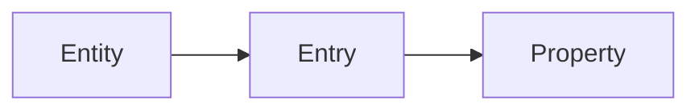
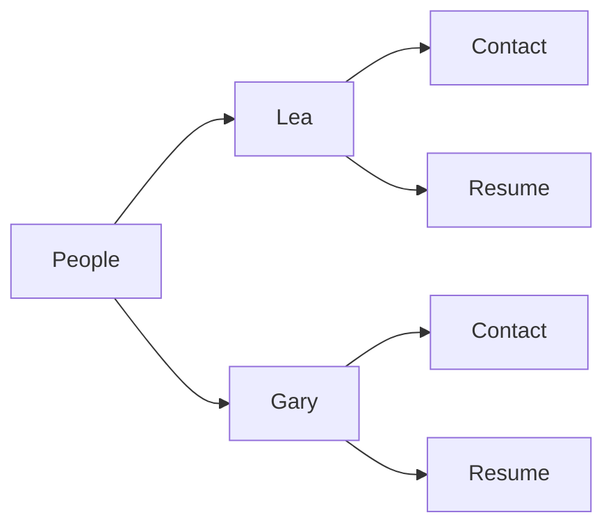
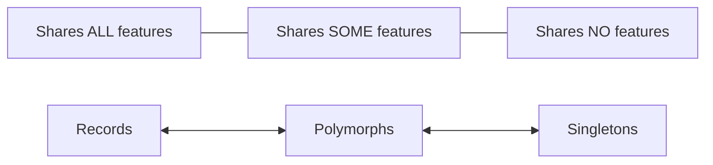

With Astro Content, **good conventions** are preferred **over tedious configurations**.

That's why this integration follows Astro own philosophy, which
promote **file based routing**.

Similarly, where other content frameworks have chosen imperative, non-standard, centralized content modeling, A.C. works the opposite way.
The ubiquitous, declarative **JSON schemas** are first-class citizen, and are
placed in the **corresponding entity folder**, which make it ultimately **portable**.

# Hierarchy

Conventions are modeled upon this relatively flat hierarchy:



<div align="center">

…which practically gives:

</div>



Why this <strong>3-levels</strong> nesting?  
Here is the logic behind this:

- Mimic a relational database design as: **Table** > **Row** > **Column**.
- …or a document based DB (as Mongo) like: **Collection** > **Document** > **Field**.
- Reduce mental load, too many levels makes thing exponentially harder to track.
- Encourage cross-referencing documents and re-usability, over brittle, overly specific deep nesting.
- 1 level = 1 business concern = 1 physical "role", mirrored in paths structure.
- With CMS, like Wordpress or Strapi, you typically get "post types" and "pages" with their own "fields", all of which are mapped to the RDBMS.

Please note that a property (file) itself, like a `<person>/contact.{md,mdx,yaml}` can host as many levels as you need.  
It's JSON, in the end, even if it is expressed in pure YAML or YAML in Markdown front matter.

> **Note**: Astro Content might support content base switching in the future, that means one more level, if you really need it.  
> In the meanwhile, you can merge entities, when glob-importing, with symbolic links (see _Tips and Tricks_ section),
> or simply using different Astro projects, if it's OK for you.

It should be possible to make Astro Content support indefinite levels of nesting,  
reflecting your own intricate schema design. But for now, it will make development too convoluted, while not being desirable in most cases,
so we stick to the widely spread conventions described above.

If you feel like a property (file) is going into a black hole, with multiples sub-properties, **extract it to a new entity**, then make **cross-references**, later resolved in your **application** itself (see MongoDB development patterns).

## Directory structure

Example directory structure for your `./content` base:

```sh
content
├── default.schema.yaml           # <- Mother of all newly created entities,
│                                 #    it's customizable.
│
├── [entities]                    # —————————————— Theoretical model ———————————
│   │
│   ├── [entity].schema.yaml      # <- Actual schema defining single entries.
│   ├── [entry]
│   │   ├── [property-a].yaml
│   │   ├── [property-b].yaml     # <- Property (file) can be optional.
│   │   └── [property-c].md
│   │
│   │
│   │                             # —————————————— Real world examples —————————
├── people
│   ├── person.schema.yaml        # <- Notice singular entity name for schema.
│   ├── pierre-corneille
│   │   ├── gallery.yaml
│   │   └── biography.md
│   ├── jean-racine
│   │   ├── gallery.yaml
│   │   ├── references.yaml
│   │   └── biography.md
│   │
├── pages
│   ├── page.schema.yaml          # <- An entry can share ALL, SOME,
│   ├── home                      #    or NONE of schema defined properties.
│   │   ├── header.md
│   │   ├── main.md
│   │   └── footnotes.md
│   ├── contact
│   │   ├── main.md
│   │   ├── resume.md
│   │   └── links.yaml
│   ├── not-found
│   │   ├── message.md
│   │   └── cool-meme.md
├── ...
│   └── ...
│
└── index.ts                      # <- Import helper. You can ignore it.
```

Entries can share the same features, can have some of their own, or even be totally independent.  
That's it: an entry can be part of a collection like "My vacation" in "Blog posts", or a singleton like "My resume" in "Web pages".

An entry is a flexible concept. As a part of an entity, you could make it relaxed, or very strict.  
Astro Content doesn't care on how you design your content base, it's up to you.

<div align="center">

**Entries** singularity spectrum:

</div>



## Naming conventions

Naming can be done inside JSON Schemas themselves with `title`, or if not set, will be inferred from your file paths.

**`my-blog-post/foot-notes.md`** automatically becomes **"My blog post > Foot notes"** for display and **`myBlogPost.footNotes`** for JavaScript object notation.

# Tips and tricks

<!-- Not working (Vite / Astro glob difference issue) -->
<!-- - Symbolic links are working, useful for gathering markdown from relative folder in the same mono-repo., for example here, in [`docs` content](https://github.com/JulianCataldo/astro-content/tree/master/docs/content). -->

- Folder hierarchy is flattened. It's the `*.schema.yaml` that is authoritative on "what is an entity" to collect, as in the sibling entries folders. That means that you could nest folders as you want, the parent folders (without schema) will be ignored.
- Use `@` or `_` prefixes, if you want to pin entities on top, e.g.: `@inbox`.  
  Special characters are stripped out anyway, while retaining order for inside your editor (OK, it's a hack 😅).

<!-- Some of these tips here are experiments, or found by accident. They might explode in your hands. It's an alpha version after all 🤫. -->
