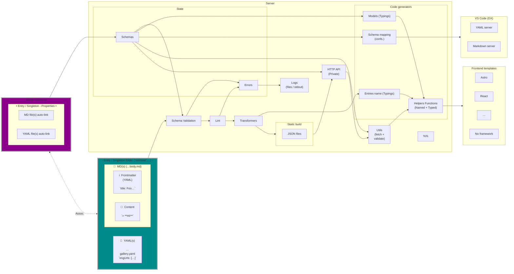

# How does Content Maestro works?

```mermaid

flowchart LR

style Schemas fill:darkmagenta,stroke:darkgrey,stroke-width:4px
subgraph Schemas["YAML Schemas"]
   direction LR
   subgraph EntryDefinition["• Entry / Singleton - Properties •"]
     direction LR
     MDf["MD file(s) auto-link"]
     YAMLf["YAML file(s) auto-link"]
   end
end


style content fill:darkcyan,stroke:darkgrey,stroke-width:4px
subgraph content["- Entry / Singleton folder ('red-boat',…) -"]
  direction LR
  YAML["📃  YAML(s)\n\n…\ngallery.yaml\n`imgUrls: […]`"]
  subgraph Markdown["📃  MD(s) (…body.md) "]
    direction LR
    fm["ℹ️  Frontmatter\n(YAML)\n\n`title: Foo…`"]
    cnt["📝  Content\n\n`> **Hi!**`"]
  end
end


subgraph VSCode["VS Code (DX)"]
  direction LR
  yaml["YAML server"]
  remark["Markdown server"]
end


subgraph Server["Server"]
    direction LR
    Validation["Schema Validation"]
    Transformers
    Lint
    API["HTTP API\n(Private)"]
    Utils["Utils\n(fetch +\n validate)"]

   subgraph codegen["Code generators"]
     Entries["Entries name (Typings)"]
     wsp["Schema mapping\n(confs.)"]
     types["Models (Typings)"]
     Named["Helpers Functions\n(Named + Typed)"]
   end
%%
  subgraph state["State"]
    SchemasState["Schemas"]
    ErrorsState["Errors"]
  end
  Logs["Logs\n(files / stdout)"]

%%  subgraph Errors["Errors logs (file or stdout)"]
%%   direction LR
%%   LintErr["Linting"]
%%   SchemaErr["Schemas"]
%%  end

  subgraph Files["Static build"]
    jsons["JSON files"]
  end
%%
end


subgraph Frontend["Frontend templates"]
  direction LR
  Astro
  React
  Else["…"]
  No["No framework"]
end


content-->Validation
%% content--->Validation
Transformers--->Entries

Entries-->Named
API-->Utils
Named-->Frontend
Utils-->Named
types-->Named


wsp--->VSCode
Validation-->ErrorsState
Validation-->Lint
Lint-->ErrorsState
Lint-->Transformers
%% Validation--->Utils

Transformers-->Files
%% Transformers--->LintErr


SchemasState-->Validation
SchemasState-->types
SchemasState-->wsp
SchemasState-->Utils
Schemas-->SchemasState
Files-->API
SchemasState-->API

ErrorsState-->Logs

%% linkStyle 15 stroke-width:2px,fill:none,stroke:black;
Schemas<-.->|Assoc.| content


```
